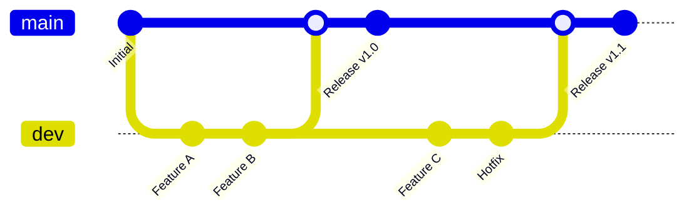
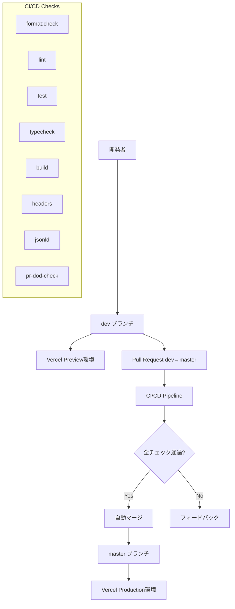
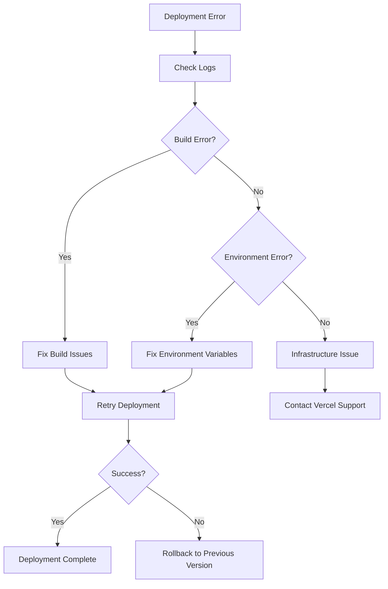
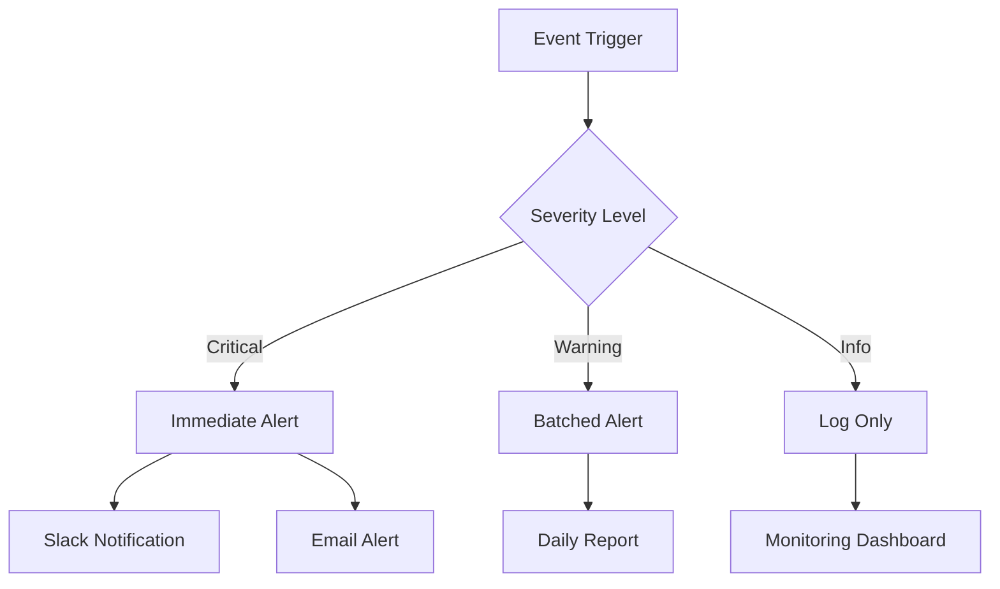

# Design Document

## Overview

Suptiaプロジェクトにおけるmaster/dev 2ブランチ体制によるGit運用フローの設計。シンプルで効率的な開発体験を提供しながら、本番環境の安全性を確保する。GitHub Actions、Vercel、および各種品質チェックツールを統合した自動化パイプラインを構築する。

## Architecture

### ブランチ構成アーキテクチャ



### システム全体アーキテクチャ



## Components and Interfaces

### 1. GitHub Repository Configuration

#### Branch Protection Rules

**Master Branch Protection:**
```yaml
master:
  protection_rules:
    required_status_checks:
      strict: true
      contexts:
        - "format:check"
        - "lint" 
        - "test"
        - "typecheck"
        - "build"
        - "headers"
        - "jsonld"
        - "pr-dod-check"
    required_pull_request_reviews:
      required_approving_review_count: 1
      dismiss_stale_reviews: true
      require_code_owner_reviews: true
    enforce_admins: true
    required_linear_history: true
    allow_force_pushes: false
    allow_deletions: false
    required_conversation_resolution: true
```

**Dev Branch Configuration:**
```yaml
dev:
  protection_rules: null  # 直接push許可
  auto_deploy: true       # Vercel Preview自動デプロイ
```

#### Repository Settings

```yaml
repository:
  default_branch: "master"
  auto_delete_head_branches: true
  allow_squash_merge: true
  allow_merge_commit: false
  allow_rebase_merge: false
```

### 2. CI/CD Pipeline Design

#### GitHub Actions Workflow

```yaml
# .github/workflows/ci.yml
name: CI/CD Pipeline
on:
  push:
    branches: [dev, master]
  pull_request:
    branches: [master]

concurrency:
  group: ${{ github.workflow }}-${{ github.ref }}
  cancel-in-progress: true

jobs:
  quality-checks:
    runs-on: ubuntu-latest
    timeout-minutes: 15
    strategy:
      matrix:
        check: [format, lint, test, typecheck, build, headers, jsonld]
    steps:
      - uses: actions/checkout@v4
      - name: Setup Node.js
        uses: actions/setup-node@v4
        with:
          node-version: '18'
          cache: 'npm'
      - run: npm ci
      - run: npm run ${{ matrix.check }}

  pr-dod-check:
    if: github.event_name == 'pull_request'
    runs-on: ubuntu-latest
    timeout-minutes: 10
    steps:
      - uses: actions/checkout@v4
      - name: Run DoD Check
        run: node scripts/check-dod.mjs
```

### 3. Vercel Integration Design

#### Deployment Configuration

```json
{
  "buildCommand": "npm run build",
  "outputDirectory": "apps/web/.next",
  "installCommand": "npm install",
  "framework": "nextjs",
  "regions": ["nrt1"],
  "functions": {
    "apps/web/src/app/api/**/*.ts": {
      "runtime": "nodejs18.x"
    }
  }
}
```

#### Environment Variables Strategy

```yaml
environments:
  production:
    branch: "master"
    domain: "suptia.com"
    variables:
      - NEXT_PUBLIC_SANITY_PROJECT_ID
      - NEXT_PUBLIC_SANITY_DATASET
      - NEXT_PUBLIC_SITE_URL
      - SANITY_API_TOKEN
      - SANITY_API_VERSION
  
  preview:
    branch: "dev"
    domain: "suptia-kiro-git-dev-*.vercel.app"
    variables:
      - NEXT_PUBLIC_SANITY_PROJECT_ID
      - NEXT_PUBLIC_SANITY_DATASET
      - NEXT_PUBLIC_SITE_URL
      - SANITY_API_TOKEN
      - SANITY_API_VERSION
```

### 4. Quality Assurance Components

#### Pre-commit Hooks

```yaml
# .husky/pre-commit
#!/usr/bin/env sh
npm run precommit
```

```json
{
  "scripts": {
    "precommit": "npm run format && npm run lint && npm run test && npm run env:check"
  },
  "lint-staged": {
    "apps/web/**/*.{js,jsx,ts,tsx}": [
      "prettier --write",
      "eslint --fix"
    ]
  }
}
```

#### Definition of Done (DoD) Checker

```javascript
// scripts/check-dod.mjs
export const dodCriteria = [
  {
    name: "Code Quality",
    checks: ["format", "lint", "typecheck"]
  },
  {
    name: "Testing",
    checks: ["test", "coverage"]
  },
  {
    name: "Build & Deploy",
    checks: ["build", "headers", "jsonld"]
  },
  {
    name: "Documentation",
    checks: ["readme", "changelog"]
  }
];
```

## Data Models

### 1. Branch Model

```typescript
interface Branch {
  name: 'master' | 'dev';
  protection: BranchProtection | null;
  deployTarget: DeploymentEnvironment;
  allowDirectPush: boolean;
}

interface BranchProtection {
  requiredStatusChecks: string[];
  requiredReviews: number;
  enforceAdmins: boolean;
  requireLinearHistory: boolean;
  allowForcePushes: boolean;
}
```

### 2. Deployment Model

```typescript
interface DeploymentEnvironment {
  name: 'production' | 'preview';
  branch: string;
  domain: string;
  environmentVariables: EnvironmentVariable[];
  autoDeployEnabled: boolean;
}

interface EnvironmentVariable {
  key: string;
  value: string;
  encrypted: boolean;
  environments: ('production' | 'preview')[];
}
```

### 3. CI/CD Pipeline Model

```typescript
interface Pipeline {
  trigger: PipelineTrigger;
  jobs: Job[];
  concurrency: ConcurrencyConfig;
}

interface Job {
  name: string;
  checks: Check[];
  timeout: number;
  dependencies: string[];
}

interface Check {
  name: string;
  command: string;
  required: boolean;
  failFast: boolean;
}
```

## Error Handling

### 1. CI/CD Pipeline Errors

```yaml
error_handling:
  build_failure:
    action: "block_merge"
    notification: "slack_webhook"
    retry_policy: "manual"
  
  test_failure:
    action: "block_merge"
    notification: "github_comment"
    retry_policy: "automatic_once"
  
  deployment_failure:
    action: "rollback"
    notification: "email_alert"
    retry_policy: "manual"
```

### 2. Branch Protection Violations

```typescript
interface ProtectionViolation {
  type: 'direct_push' | 'missing_review' | 'failed_check';
  branch: string;
  user: string;
  timestamp: Date;
  resolution: 'blocked' | 'override' | 'fixed';
}
```

### 3. Deployment Error Recovery



## Testing Strategy

### 1. Automated Testing Levels

```yaml
testing_pyramid:
  unit_tests:
    coverage_threshold: 80%
    tools: ["vitest", "jest"]
    run_on: ["push", "pr"]
  
  integration_tests:
    coverage_threshold: 60%
    tools: ["playwright", "cypress"]
    run_on: ["pr", "merge"]
  
  e2e_tests:
    coverage_threshold: 40%
    tools: ["playwright"]
    run_on: ["merge", "deploy"]
```

### 2. Quality Gates

```typescript
interface QualityGate {
  name: string;
  criteria: QualityCriteria[];
  blocking: boolean;
  environment: 'dev' | 'master';
}

interface QualityCriteria {
  metric: 'test_coverage' | 'build_success' | 'lint_errors';
  threshold: number;
  operator: '>=' | '<=' | '=';
}
```

### 3. Performance Testing

```yaml
performance_tests:
  lighthouse:
    thresholds:
      performance: 90
      accessibility: 95
      best_practices: 90
      seo: 95
    run_on: ["pr", "deploy"]
  
  load_testing:
    tool: "k6"
    scenarios: ["normal_load", "stress_test"]
    run_on: ["deploy"]
```

## Security Considerations

### 1. Branch Access Control

```yaml
access_control:
  master:
    direct_push: false
    force_push: false
    delete: false
    admin_override: true
  
  dev:
    direct_push: true
    force_push: true
    delete: false
    admin_override: true
```

### 2. Secret Management

```yaml
secrets:
  github_actions:
    - VERCEL_TOKEN
    - SANITY_API_TOKEN
    - SLACK_WEBHOOK_URL
  
  vercel:
    production:
      - SANITY_API_TOKEN
      - DATABASE_URL
    preview:
      - SANITY_API_TOKEN
      - DATABASE_URL_PREVIEW
```

### 3. Security Scanning

```yaml
security_checks:
  dependency_scanning:
    tool: "dependabot"
    schedule: "weekly"
    auto_merge: "patch_only"
  
  code_scanning:
    tool: "codeql"
    languages: ["typescript", "javascript"]
    schedule: "on_push"
  
  secret_scanning:
    enabled: true
    push_protection: true
```

## Monitoring and Observability

### 1. Deployment Monitoring

```yaml
monitoring:
  deployment_success_rate:
    metric: "deployments_successful / deployments_total"
    threshold: 0.95
    alert: "slack"
  
  build_time:
    metric: "avg(build_duration)"
    threshold: "10m"
    alert: "email"
  
  test_execution_time:
    metric: "avg(test_duration)"
    threshold: "5m"
    alert: "github_issue"
```

### 2. Performance Metrics

```typescript
interface PerformanceMetrics {
  buildTime: number;
  testExecutionTime: number;
  deploymentTime: number;
  codeQualityScore: number;
  testCoverage: number;
}
```

### 3. Alerting Strategy



## Integration Points

### 1. GitHub ↔ Vercel Integration

```yaml
github_vercel:
  webhook_events:
    - push
    - pull_request
    - deployment_status
  
  deployment_triggers:
    production: "push to master"
    preview: "push to dev"
  
  status_checks:
    - vercel_deployment_ready
    - vercel_build_successful
```

### 2. CI/CD ↔ Quality Tools Integration

```yaml
tool_integrations:
  eslint:
    config: "apps/web/.eslintrc.json"
    output_format: "github_annotations"
  
  prettier:
    config: "apps/web/.prettierrc"
    check_only: true
  
  vitest:
    config: "apps/web/vitest.config.ts"
    coverage_reporter: "lcov"
```

### 3. Notification Integrations

```typescript
interface NotificationConfig {
  slack: {
    webhook: string;
    channels: {
      deployments: '#deployments';
      alerts: '#alerts';
      general: '#general';
    };
  };
  email: {
    recipients: string[];
    templates: {
      deployment_success: string;
      deployment_failure: string;
      security_alert: string;
    };
  };
}
```