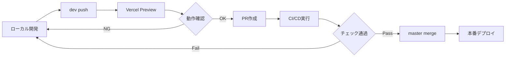

# Git運用ルール

## 基本原則: Master/Dev 2ブランチ体制

### 1. ブランチ構成

- **master**: 本番デプロイ専用ブランチ（自動デプロイ対象）
- **dev**: 常設開発ブランチ（Vercel Preview対象）

### 2. ブランチの役割

#### masterブランチ

- 本番環境に自動デプロイされる
- 常に安定した状態を維持
- 直接pushは禁止（保護ブランチ設定）
- devからのPR経由でのみ更新

#### devブランチ

- すべての開発作業を行う常設ブランチ
- Vercel Previewで動作確認可能
- 開発者が直接push可能
- 削除せず常に維持

### 3. 開発ワークフロー

#### 日常の開発フロー

1. **ローカル開発**: devブランチで修正・コミット
2. **プッシュ**: `git push origin dev`
3. **Preview確認**: Vercel Previewで動作確認
4. **本番反映**: 問題なければPR作成（dev → master）
5. **自動デプロイ**: マージ後、masterが自動デプロイ

#### 具体的な作業手順

```bash
# 1. devブランチに切り替え
git switch dev

# 2. 最新の状態に更新
git pull origin dev

# 3. 開発作業（コード修正、テスト等）
# ... 作業 ...

# 4. 変更をコミット
git add .
git commit -m "feat: 新機能の実装"

# 5. devブランチにプッシュ
git push origin dev

# 6. Vercel Previewで確認
# https://your-app-git-dev-your-team.vercel.app

# 7. 問題なければPR作成（GitHub UI）
# dev → master
```

#### コミット方針

- **ローカル**: 軽量チェック（format + lint-staged）のみ
- **CI**: 重い処理（test, typecheck, build, compliance）で品質担保
- **緊急時**: `HUSKY=0 git commit` または `git commit --no-verify` で回避可能

## 自動化システム

### CI/CD パイプライン

- **dev push**: Vercel Preview自動デプロイ
- **master push**: 本番環境自動デプロイ
- **PR作成**: 必須チェック実行（format, lint, test, typecheck, build）

### デプロイフロー



## 期待される状態

### 理想的なリポジトリ状態

- **リモートブランチ**: master, dev の2つのみ
- **ローカルブランチ**: 主にdevブランチで作業
- **履歴**: 線形で追跡可能な履歴

### 禁止事項

- masterへの直接プッシュ（保護ルールで防止）
- devブランチの削除
- 一時的な作業ブランチの長期保持

## トラブルシューティング

### コミットが失敗する場合

1. **通常のコミット**:

   ```bash
   git commit -m "your message"
   ```

2. **フック回避（緊急時）**:

   ```bash
   # Huskyを無効化
   HUSKY=0 git commit -m "your message"

   # または pre-commit フックをスキップ
   git commit --no-verify -m "your message"
   ```

3. **GPG署名エラーの場合**:
   ```bash
   git config --local commit.gpgsign false
   ```

### devブランチの同期問題

1. **リモートdevとの同期**:

   ```bash
   git switch dev
   git pull origin dev
   ```

2. **masterからの最新取り込み**:

   ```bash
   git switch dev
   git pull origin master
   git push origin dev
   ```

3. **コンフリクト解決**:
   ```bash
   # コンフリクト発生時
   git status
   # ファイルを手動修正
   git add .
   git commit -m "resolve: merge conflict"
   git push origin dev
   ```

### 緊急時の対応

- masterブランチに問題がある場合は、直ちに開発を停止
- devブランチから緊急修正を実施
- 修正後、緊急PRでmasterに統合

## 設定確認項目

### GitHub リポジトリ設定

- [ ] Branch protection rules for master
- [ ] Require pull request reviews
- [ ] Require status checks to pass
- [ ] dev ブランチの作成と保護設定

### Vercel設定

- [ ] master ブランチ → 本番環境
- [ ] dev ブランチ → Preview環境
- [ ] 自動デプロイ設定

### ワークフロー設定

- [ ] CI workflows configured for dev and master
- [ ] DoD check enabled for PRs

## 利点

### 開発効率

- シンプルな2ブランチ体制
- 常設devブランチによる継続的開発
- Vercel Previewによる事前確認

### 品質保証

- masterブランチの品質保証
- 必須チェックによる品質ゲート
- Preview環境での動作確認

### 運用安定性

- 本番環境との一対一対応
- 予測可能なデプロイフロー
- 緊急対応時の明確な手順

## 移行手順

### 既存プロジェクトからの移行

1. **devブランチ作成**:

   ```bash
   git switch master
   git pull origin master
   git switch -c dev
   git push origin dev
   ```

2. **GitHub設定更新**:
   - devブランチの保護設定
   - Vercel連携設定

3. **開発者への周知**:
   - 新しいワークフローの説明
   - 移行スケジュールの共有
