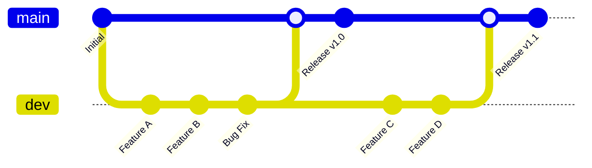
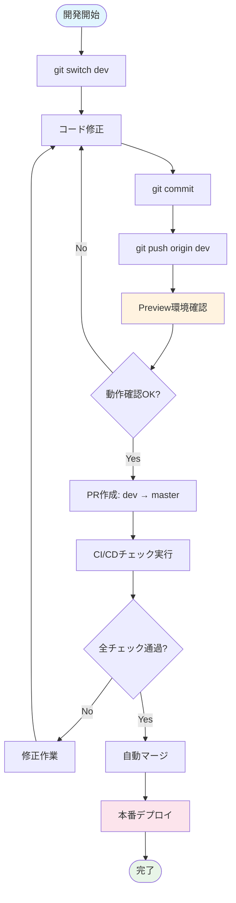
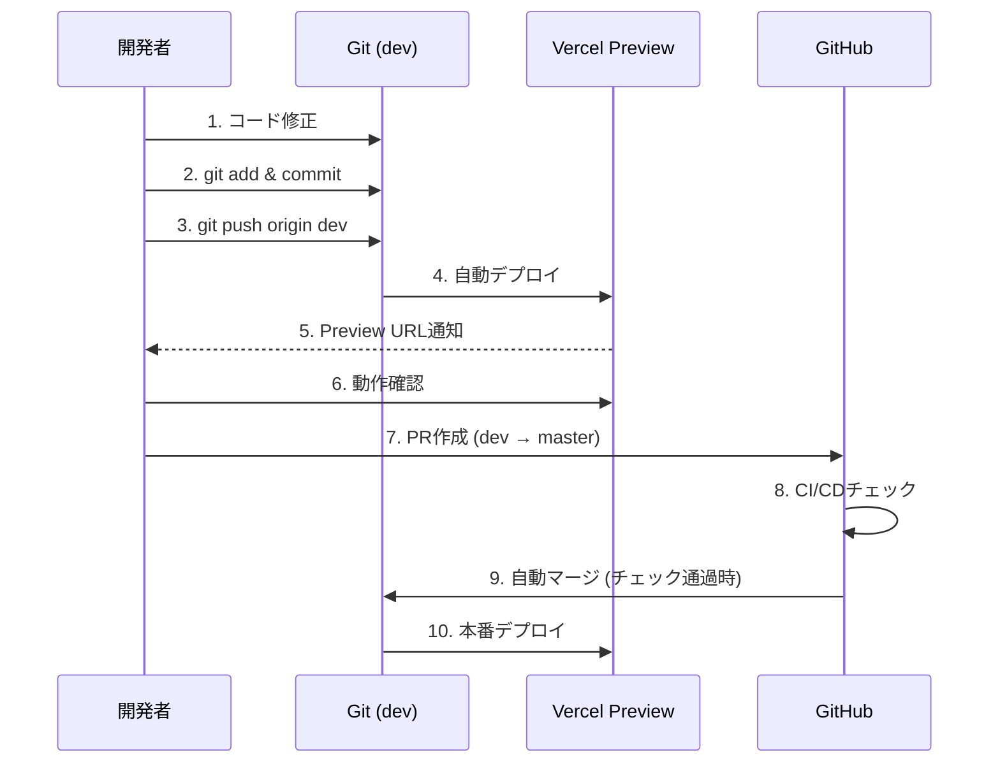

# Suptia 開発フローガイド

## 概要

Suptiaプロジェクトでは、**master/dev 2ブランチ体制**による効率的で安全な開発フローを採用しています。このガイドでは、新しい開発者が迅速にプロジェクトに参加し、生産性を最大化できるよう、ステップバイステップで開発フローを説明します。

## ブランチ構成



### ブランチの役割

| ブランチ | 用途       | デプロイ先 | 直接Push |
| -------- | ---------- | ---------- | -------- |
| `master` | 本番環境用 | Production | ❌ 禁止  |
| `dev`    | 開発環境用 | Preview    | ✅ 許可  |

## 開発フロー全体図



## ステップバイステップガイド

### 1. 開発環境のセットアップ

#### 初回セットアップ

```bash
# リポジトリをクローン
git clone https://github.com/your-org/suptia.git
cd suptia

# 依存関係をインストール
npm install

# 環境変数を設定
cp apps/web/.env.local.example apps/web/.env.local
# .env.localファイルを編集して必要な値を設定
```

#### 開発ブランチに切り替え

```bash
# 開発ブランチに切り替え（これだけでOK！）
git switch dev
```

### 2. 日常の開発作業

#### 基本的な開発サイクル



#### 具体的なコマンド例

```bash
# 1. 最新のdevブランチを取得
git pull origin dev

# 2. コードを修正
# (お好みのエディタで作業)

# 3. 変更をステージング
git add .

# 4. コミット（わかりやすいメッセージで）
git commit -m "feat: 新機能Xを追加"

# 5. devブランチにプッシュ
git push origin dev
```

### 3. Preview環境での確認

#### 自動デプロイの流れ

1. **devブランチにpush** → Vercel Preview環境が自動更新
2. **Preview URL取得** → GitHub ActionsまたはVercelダッシュボードで確認
3. **動作確認** → 実際のブラウザで機能をテスト

#### Preview URLの確認方法

```bash
# Preview URLを取得するスクリプト
npm run get-preview-url
```

または、Vercelダッシュボードで確認：

- https://vercel.com/your-team/suptia

### 4. 本番リリース（PR作成）

#### PR作成の手順

1. **GitHub UIでPR作成**
   - Base: `master`
   - Compare: `dev`
   - タイトル: 簡潔で分かりやすく
   - 説明: 変更内容と影響範囲を記載

2. **自動チェックの実行**
   - format:check
   - lint
   - test
   - typecheck
   - build
   - headers
   - jsonld
   - pr-dod-check

3. **レビューと承認**
   - 最低1名の承認が必要
   - 新しいコミットがあると承認がリセット

4. **自動マージ**
   - 全チェック通過 + 承認 → 自動マージ
   - masterブランチ → 本番環境に自動デプロイ

### 5. 品質チェックの詳細

#### 実行されるチェック項目

| チェック     | 内容                     | 実行タイミング |
| ------------ | ------------------------ | -------------- |
| format:check | コードフォーマット       | 全push         |
| lint         | ESLintによる静的解析     | 全push         |
| test         | 単体テスト実行           | 全push         |
| typecheck    | TypeScript型チェック     | 全push         |
| build        | ビルド成功確認           | 全push         |
| headers      | セキュリティヘッダー確認 | 全push         |
| jsonld       | 構造化データ検証         | 全push         |
| pr-dod-check | Definition of Done確認   | PR作成時のみ   |

#### ローカルでのチェック実行

```bash
# 全チェックを一括実行
npm run precommit

# 個別チェック
npm run format:check
npm run lint
npm run test
npm run typecheck
npm run build
npm run headers
npm run jsonld
```

## トラブルシューティング

### よくある問題と解決方法

#### 1. CI/CDチェックが失敗する

**症状**: PRでチェックが赤くなる

**解決方法**:

```bash
# ローカルで該当チェックを実行
npm run lint  # 例：lintエラーの場合

# 自動修正を試す
npm run lint:fix
npm run format

# 修正後、再度push
git add .
git commit -m "fix: lint/format errors"
git push origin dev
```

#### 2. Preview環境が更新されない

**症状**: devにpushしてもPreview環境が古いまま

**解決方法**:

1. Vercelダッシュボードでデプロイ状況を確認
2. 環境変数が正しく設定されているか確認
3. ビルドエラーがないか確認

```bash
# 環境変数チェック
npm run env:check

# ローカルビルドテスト
npm run build
```

#### 3. masterブランチに直接pushしようとしてエラー

**症状**: `remote: error: GH006: Protected branch update failed`

**解決方法**:

```bash
# devブランチに切り替え
git switch dev

# 変更をdevにpush
git push origin dev

# その後、GitHub UIでPRを作成
```

#### 4. 環境変数が見つからないエラー

**症状**: `Error: Environment variable XXX is not defined`

**解決方法**:

```bash
# .env.localファイルを確認
cat apps/web/.env.local

# 必要な環境変数を追加
echo "NEXT_PUBLIC_SANITY_PROJECT_ID=your-project-id" >> apps/web/.env.local

# Vercel環境変数も確認・設定
npm run env:sync
```

## 開発のベストプラクティス

### コミットメッセージの書き方

```bash
# 良い例
git commit -m "feat: ユーザー認証機能を追加"
git commit -m "fix: 価格計算のバグを修正"
git commit -m "docs: READMEにセットアップ手順を追加"

# 避けるべき例
git commit -m "update"
git commit -m "fix bug"
git commit -m "WIP"
```

### ブランチの使い方

```bash
# ✅ 推奨: devブランチで直接作業
git switch dev
# 作業...
git push origin dev

# ❌ 非推奨: 不要なfeatureブランチ作成
git switch -c feature/new-feature  # 避ける
```

### テストの実行

```bash
# 開発中は watch モードで
npm run test:watch

# CI/CDと同じ条件でテスト
npm run test

# カバレッジ確認
npm run test:coverage
```

## 緊急時の対応

### 本番環境で問題が発生した場合

1. **即座にロールバック**

```bash
# ロールバックスクリプト実行
npm run rollback:production
```

2. **問題の調査**

- Vercelダッシュボードでエラーログ確認
- GitHub Actionsでビルドログ確認

3. **修正とデプロイ**

```bash
# devブランチで修正
git switch dev
# 修正作業...
git push origin dev
# PR作成 → 自動デプロイ
```

### 開発環境で問題が発生した場合

```bash
# 依存関係の再インストール
rm -rf node_modules package-lock.json
npm install

# キャッシュクリア
npm run clean

# 環境変数の再確認
npm run env:check
```

## 参考リンク

- [GitHub Repository](https://github.com/your-org/suptia)
- [Vercel Dashboard](https://vercel.com/your-team/suptia)
- [Sanity Studio](https://your-project.sanity.studio)
- [本番サイト](https://suptia.com)

## サポート

質問や問題がある場合は、以下の方法でサポートを受けられます：

1. **GitHub Issues**: バグ報告や機能要求
2. **Slack**: `#development` チャンネル
3. **ドキュメント**: このガイドや他の技術文書

---

**重要**: このフローは開発効率と品質のバランスを取るよう設計されています。不明な点があれば、遠慮なく質問してください！
