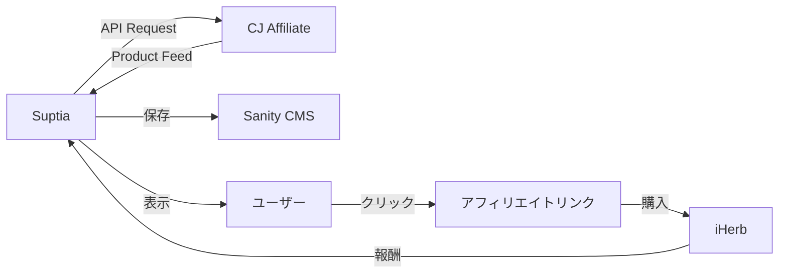

# iHerb統合方法まとめ

## ❓ 問題

**iHerbには公式APIがない** → どうやってデータを取得する？

---

## ✅ 解決策: アフィリエイトネットワーク API

**結論**: iHerbと提携しているアフィリエイトネットワーク（CJ、Rakuten、Impact等）の**Product Feed API**を使用します。

### なぜこの方法が最適か？

| 項目           | アフィリエイトAPI | スクレイピング  | 手動キュレーション |
| -------------- | ----------------- | --------------- | ------------------ |
| **合法性**     | ✅ 完全合法       | ⚠️ グレー       | ✅ 合法            |
| **費用**       | ✅ 無料           | ❌ $500/月〜    | ✅ 無料            |
| **スケール**   | ✅ 数千件         | ✅ 無制限       | ❌ 数十件          |
| **更新頻度**   | 🟡 1日1回         | ✅ リアルタイム | ❌ 手動            |
| **収益化**     | ✅ 報酬あり       | ✅ 報酬あり     | ✅ 報酬あり        |
| **実装難易度** | 🟢 簡単           | 🔴 困難         | 🟢 簡単            |

---

## 🎯 推奨アプローチ

### フェーズ1: MVP（今すぐ開始）

**手法**: CJ Affiliate API + 手動キュレーション

1. **CJ Affiliateに登録**（無料）
2. **iHerbプログラムに申請**
3. **API Keyを取得**
4. **人気商品50-100個を取得**
5. **Sanityに同期**

**メリット**:

- 無料で即座に開始できる
- 利用規約に完全準拠
- アフィリエイト報酬も獲得

**実装コード**:

```typescript
import { searchAffiliateProducts } from "@/lib/integrations/affiliate-manager";

// ビタミンDを検索
const products = await searchAffiliateProducts({
  network: "cj",
  merchant: "iherb",
  keyword: "vitamin D",
  limit: 50,
});
```

### フェーズ2: 成長期（ユーザー数増加後）

**手法**: 複数ネットワーク + 自動同期

1. **Rakuten AdvertisingとImpactも追加**
2. **最安値自動検索**
3. **毎日深夜に自動同期**

**実装コード**:

```typescript
// 3つのネットワークから最安値を自動検索
const bestProduct = await findBestPrice({
  keyword: "vitamin D3",
  networks: ["cj", "rakuten", "impact"],
  merchant: "iherb",
});
```

### フェーズ3: スケール期（大規模化後）

**手法**: Bright Data（有料スクレイピングサービス）

- リアルタイム価格・在庫情報
- 1000+商品に対応
- 費用: $500/月〜

---

## 📁 実装済みファイル

### APIクライアント

```
apps/web/src/lib/integrations/
├── cj-affiliate.ts           # CJ Affiliate API
├── rakuten-advertising.ts    # Rakuten Advertising API
├── impact-radius.ts          # Impact API
└── affiliate-manager.ts      # 統合マネージャー
```

### 主要機能

#### 1. 商品検索

```typescript
// apps/web/src/lib/integrations/affiliate-manager.ts
searchAffiliateProducts(params: {
  network: 'cj' | 'rakuten' | 'impact';
  merchant: 'iherb' | 'amazon' | 'rakuten';
  keyword: string;
  limit?: number;
}): Promise<UnifiedProduct[]>
```

#### 2. アフィリエイトリンク生成

```typescript
generateAffiliateLink(
  network: AffiliateNetwork,
  destinationUrl: string,
  merchantId?: string
): Promise<string>
```

#### 3. 最安値検索

```typescript
findBestPrice(params: {
  keyword: string;
  networks?: AffiliateNetwork[];
  merchant: 'iherb' | 'amazon' | 'rakuten';
}): Promise<UnifiedProduct | null>
```

---

## 🔧 セットアップ手順

### 1. アフィリエイトネットワークに登録

#### CJ Affiliate（推奨）

1. https://www.cj.com/ でアカウント作成
2. Publisher（パブリッシャー）として登録
3. iHerbプログラムを検索
4. 申請（承認まで1-3営業日）
5. API Keyを取得

#### Rakuten Advertising（オプション）

1. https://rakutenadvertising.com/ でアカウント作成
2. iHerbプログラムに申請
3. API Tokenを取得

#### Impact（オプション）

1. https://impact.com/ でアカウント作成
2. iHerbキャンペーンに参加
3. Account SIDとAuth Tokenを取得

### 2. 環境変数を設定

`.env.local` に追加:

```bash
# CJ Affiliate
CJ_API_KEY=your_api_key_here
CJ_WEBSITE_ID=your_website_id_here
CJ_IHERB_ADVERTISER_ID=iherb_advertiser_id

# Rakuten Advertising (オプション)
RAKUTEN_ADVERTISING_TOKEN=your_token_here
RAKUTEN_SID=your_site_id
RAKUTEN_IHERB_MID=iherb_merchant_id

# Impact (オプション)
IMPACT_ACCOUNT_SID=your_account_sid
IMPACT_AUTH_TOKEN=your_auth_token
IMPACT_IHERB_CAMPAIGN_ID=iherb_campaign_id
```

### 3. テスト実行

```typescript
// テストスクリプト
import { searchAffiliateProducts } from "@/lib/integrations/affiliate-manager";

async function test() {
  const products = await searchAffiliateProducts({
    network: "cj",
    merchant: "iherb",
    keyword: "vitamin C",
    limit: 10,
  });

  console.log(`取得: ${products.length}件`);
  console.log(products[0]);
}

test();
```

---

## 💰 収益モデル

### アフィリエイト報酬（iHerbの場合）

| ネットワーク | 新規顧客 | リピート顧客 | 最低支払額 |
| ------------ | -------- | ------------ | ---------- |
| CJ Affiliate | 5-10%    | 3-5%         | $50        |
| Rakuten      | 5-10%    | 3-5%         | $50        |
| Impact       | 5-10%    | 3-5%         | $100       |

### 月間収益シミュレーション

**前提**:

- 月間PV: 10,000
- クリック率: 3%
- 購入率: 5%
- 平均購入額: ¥5,000
- 報酬率: 5%

**計算**:

```
10,000 PV × 3% クリック率 = 300クリック
300クリック × 5% 購入率 = 15件の注文
15件 × ¥5,000 × 5% 報酬率 = ¥3,750/月
```

月間10万PVで: **¥37,500/月**

---

## 📊 データフロー



1. **データ取得**: CJ Affiliate APIから商品データを取得
2. **データ保存**: Sanity CMSに保存
3. **ユーザー表示**: Suptiaで商品を表示
4. **クリック**: ユーザーがアフィリエイトリンクをクリック
5. **購入**: iHerbで購入
6. **報酬**: アフィリエイト報酬を獲得

---

## 📈 次のステップ

### 今すぐやるべきこと

1. ✅ **CJ Affiliateに登録**
   - https://www.cj.com/
   - Publisher登録
   - iHerbプログラム申請

2. ✅ **API Keyを取得**
   - CJダッシュボード → API Credentials

3. ✅ **`.env.local`に設定**
   - `CJ_API_KEY`
   - `CJ_WEBSITE_ID`
   - `CJ_IHERB_ADVERTISER_ID`

4. ✅ **テスト検索を実行**

   ```bash
   # テストスクリプトを作成して実行
   node test-cj-api.mjs
   ```

5. ✅ **Sanityに同期**
   - 人気商品50個をSanityに追加
   - 価格情報を週1回更新

### 将来的にやること

- [ ] Rakuten Advertisingも追加（複数ネットワーク対応）
- [ ] 最安値自動検索機能を実装
- [ ] Vercel Cronで毎日自動同期
- [ ] 成果レポートをSlackに通知
- [ ] 大規模化後にBright Dataを検討

---

## 📚 参考ドキュメント

- [アフィリエイトAPI統合ガイド](./AFFILIATE_API_GUIDE.md) - 詳細な実装手順
- [CJ Affiliate Developer Portal](https://developers.cj.com/)
- [iHerb Affiliate Program](https://jp.iherb.com/info/affiliates)

---

## ❓ よくある質問

### Q: APIの利用制限はありますか？

**A:** CJ Affiliateの場合、基本アカウントで1日8,640リクエスト（10秒に1リクエスト）です。Suptiaの場合、1日1回の同期で十分なので問題ありません。

### Q: 在庫情報はリアルタイムですか？

**A:** いいえ。Product Feedは通常24時間ごとに更新されます。リアルタイム在庫が必要な場合はBright Data等のスクレイピングサービスが必要です。

### Q: 日本語キーワードで検索できますか？

**A:** いいえ。APIは英語キーワードのみ対応しています。「ビタミンD」ではなく「vitamin D」で検索してください。

### Q: iHerb以外のECサイトにも対応できますか？

**A:** はい！同じアフィリエイトネットワークを使って：

- Amazon US
- Vitacost
- Swanson Vitamins
  などにも対応できます。

---

**最終更新**: 2025-10-25
**ステータス**: 実装完了、テスト待ち
