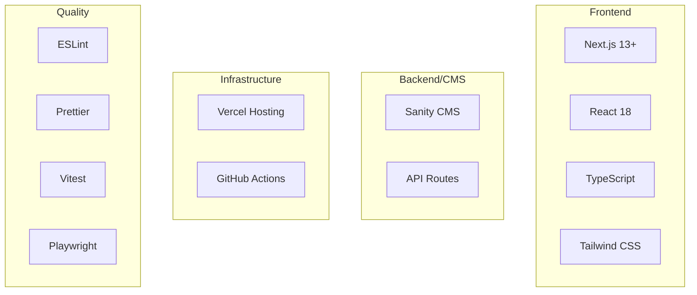

# 新規開発者オンボーディングガイド

## 🎯 このガイドの目的

Suptiaプロジェクトに新しく参加する開発者が、**30分以内**に開発環境をセットアップし、最初のコントリビューションを行えるようにすることを目的としています。

## ✅ 事前準備チェックリスト

開始前に以下が準備されていることを確認してください：

- [ ] Node.js 18以上がインストール済み
- [ ] Git がインストール・設定済み
- [ ] GitHub アカウントでリポジトリアクセス権限あり
- [ ] Vercel アカウント（デプロイ確認用）
- [ ] Sanity アカウント（CMS管理用）

## 🚀 30分セットアップガイド

### ステップ1: リポジトリのクローン（2分）

```bash
# 1. リポジトリをクローン
git clone https://github.com/your-org/suptia.git
cd suptia

# 2. ブランチ確認
git branch -a
# master (本番用)
# dev (開発用) ← ここで作業します
```

### ステップ2: 依存関係のインストール（5分）

```bash
# Node.jsバージョン確認
node --version  # v18以上であることを確認

# 依存関係インストール
npm install

# インストール完了確認
npm list --depth=0
```

### ステップ3: 環境変数の設定（3分）

```bash
# 環境変数テンプレートをコピー
cp apps/web/.env.local.example apps/web/.env.local

# 環境変数を編集（必要な値を設定）
nano apps/web/.env.local
```

**必須環境変数:**

```env
NEXT_PUBLIC_SANITY_PROJECT_ID=your-project-id
NEXT_PUBLIC_SANITY_DATASET=production
NEXT_PUBLIC_SITE_URL=http://localhost:3000
SANITY_API_TOKEN=your-api-token
SANITY_API_VERSION=2023-05-03
```

### ステップ4: 開発サーバー起動（2分）

```bash
# 開発サーバー起動
npm run dev

# ブラウザで確認
# http://localhost:3000 が開けることを確認
```

### ステップ5: 開発ブランチに切り替え（1分）

```bash
# 開発ブランチに切り替え
git switch dev

# 最新の変更を取得
git pull origin dev

# 現在のブランチ確認
git branch
# * dev ← アスタリスクがdevについていることを確認
```

### ステップ6: 初回テスト実行（5分）

```bash
# 全チェックを実行（初回は時間がかかります）
npm run precommit

# 個別チェック（問題がある場合）
npm run lint
npm run test
npm run typecheck
npm run build
```

### ステップ7: 最初のコントリビューション（12分）

#### 7-1. 簡単な変更を加える（3分）

```bash
# READMEに自分の名前を追加（例）
echo "- $(git config user.name) - $(date +%Y-%m-%d)" >> CONTRIBUTORS.md
```

#### 7-2. 変更をコミット（2分）

```bash
# 変更をステージング
git add CONTRIBUTORS.md

# コミット
git commit -m "docs: add $(git config user.name) to contributors"
```

#### 7-3. devブランチにプッシュ（2分）

```bash
# devブランチにプッシュ
git push origin dev

# プッシュ成功を確認
echo "✅ 初回プッシュ完了！"
```

#### 7-4. Preview環境確認（3分）

```bash
# Preview URLを取得
npm run get-preview-url

# または、Vercelダッシュボードで確認
# https://vercel.com/your-team/suptia
```

#### 7-5. PR作成（2分）

1. GitHub UIでPRを作成
   - Base: `master`
   - Compare: `dev`
   - Title: "docs: add new contributor"
   - Description: "新規開発者のオンボーディング完了"

2. 自動チェックが実行されることを確認
3. レビュー依頼（Slackなどで）

## 🎓 学習リソース

### 必読ドキュメント（優先順）

1. **[開発フローガイド](./DEVELOPMENT_WORKFLOW.md)** - 詳細な開発プロセス
2. **[クイックリファレンス](./QUICK_REFERENCE.md)** - 日常的なコマンド集
3. **[プロジェクト要件](../requirements.md)** - プロジェクトの全体像
4. **[設計文書](../design.md)** - アーキテクチャの理解

### 技術スタック理解



### コードベース構造

```
suptia/
├── apps/web/                 # Next.jsアプリケーション
│   ├── src/app/             # App Router
│   ├── src/components/      # Reactコンポーネント
│   ├── src/lib/            # ユーティリティ関数
│   └── src/test/           # テストファイル
├── packages/schemas/        # Sanityスキーマ
├── scripts/                # 自動化スクリプト
├── docs/                   # ドキュメント
└── .github/workflows/      # CI/CDパイプライン
```

## 🤝 チーム連携

### コミュニケーションチャンネル

- **Slack #development** - 技術的な質問・議論
- **Slack #deployments** - デプロイ通知
- **GitHub Issues** - バグ報告・機能要求
- **GitHub Discussions** - 設計に関する議論

### コードレビューのガイドライン

#### レビュー依頼時

- PRの目的と変更内容を明確に記載
- 関連するIssueやドキュメントをリンク
- スクリーンショットや動作確認結果を添付

#### レビュー実施時

- 建設的なフィードバックを心がける
- コードの品質、セキュリティ、パフォーマンスを確認
- 代替案がある場合は具体的に提案

### 質問のベストプラクティス

#### 良い質問の例

```
【質問】
Next.jsのImage最適化で、動的なサイズ指定はどのように実装すべきでしょうか？

【背景】
商品画像の表示で、レスポンシブ対応が必要です。

【試したこと】
- fill属性を使用したが、アスペクト比が崩れる
- sizes属性の設定を試行錯誤中

【期待する結果】
アスペクト比を保ちつつ、画面サイズに応じて最適化された画像表示
```

#### 避けるべき質問

- "動かないです" （具体的な症状が不明）
- "エラーが出ます" （エラーメッセージの記載なし）
- "どうすればいいですか" （何を試したかの情報なし）

## 🔧 開発ツール設定

### VS Code推奨拡張機能

```json
{
  "recommendations": [
    "esbenp.prettier-vscode",
    "bradlc.vscode-tailwindcss",
    "ms-vscode.vscode-typescript-next",
    "sanity-io.vscode-sanity",
    "github.vscode-pull-request-github"
  ]
}
```

### Git設定

```bash
# コミット署名設定（推奨）
git config --global commit.gpgsign true

# プルリクエスト用のエイリアス
git config --global alias.pr "!gh pr create"

# ログの見やすい表示
git config --global alias.lg "log --oneline --graph --decorate"
```

## 📈 成長パス

### 1週間目の目標

- [ ] 開発環境の完全セットアップ
- [ ] 最初のPRマージ
- [ ] コードベースの基本構造理解
- [ ] チームメンバーとの初回1on1

### 1ヶ月目の目標

- [ ] 独立してfeature開発が可能
- [ ] コードレビューの実施
- [ ] CI/CDパイプラインの理解
- [ ] Sanity CMSの基本操作習得

### 3ヶ月目の目標

- [ ] 複雑な機能の設計・実装
- [ ] パフォーマンス最適化の実施
- [ ] 新規開発者のメンタリング
- [ ] アーキテクチャ改善の提案

## 🆘 困ったときの連絡先

### 緊急度別連絡方法

| 緊急度  | 内容                       | 連絡方法           | 対応時間    |
| ------- | -------------------------- | ------------------ | ----------- |
| 🔴 緊急 | 本番障害、セキュリティ問題 | Slack DM + 電話    | 即座        |
| 🟡 重要 | 開発ブロッカー、CI/CD問題  | Slack #development | 2時間以内   |
| 🟢 通常 | 質問、相談、レビュー依頼   | GitHub Issue/PR    | 1営業日以内 |

### 主要連絡先

- **Tech Lead**: @tech-lead-name
- **DevOps**: @devops-name
- **Product Manager**: @pm-name

## 🎉 オンボーディング完了

以下をすべて完了したら、オンボーディング成功です！

- [ ] 開発環境セットアップ完了
- [ ] 最初のPRが正常にマージされた
- [ ] Preview環境での動作確認ができた
- [ ] チームSlackで自己紹介を投稿した
- [ ] 1on1ミーティングを実施した

**おめでとうございます！🎊 Suptiaチームへようこそ！**

---

💡 **Next Steps**: [開発フローガイド](./DEVELOPMENT_WORKFLOW.md)を読んで、日常的な開発作業に慣れていきましょう。
