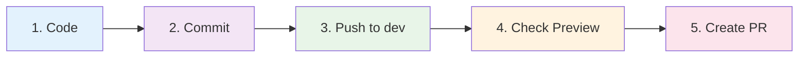
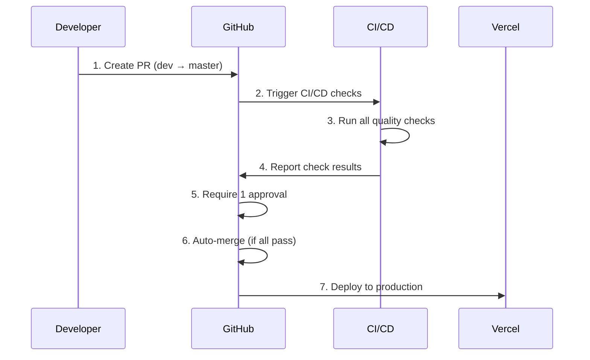

# Suptia 開発フロー クイックリファレンス

## 🚀 今すぐ始める

```bash
# 1. 開発ブランチに切り替え
git switch dev

# 2. 最新を取得
git pull origin dev

# 3. 作業開始！
```

## 📋 日常のワークフロー

### 基本サイクル（5ステップ）



### コマンド一覧

| 操作            | コマンド                                  |
| --------------- | ----------------------------------------- |
| 開発開始        | `git switch dev`                          |
| 変更をコミット  | `git add . && git commit -m "feat: 説明"` |
| devにプッシュ   | `git push origin dev`                     |
| 全チェック実行  | `npm run precommit`                       |
| Preview URL取得 | `npm run get-preview-url`                 |

## 🔍 チェック項目

### 自動実行されるチェック

- ✅ **format:check** - コードフォーマット
- ✅ **lint** - ESLint静的解析
- ✅ **test** - 単体テスト
- ✅ **typecheck** - TypeScript型チェック
- ✅ **build** - ビルド確認
- ✅ **headers** - セキュリティヘッダー
- ✅ **jsonld** - 構造化データ
- ✅ **pr-dod-check** - Definition of Done (PR時のみ)

### ローカル実行

```bash
# 個別チェック
npm run lint
npm run test
npm run typecheck
npm run build

# 一括チェック
npm run precommit
```

## 🌐 環境とURL

| 環境           | ブランチ | URL            | 更新タイミング |
| -------------- | -------- | -------------- | -------------- |
| **Preview**    | `dev`    | `*.vercel.app` | devへのpush時  |
| **Production** | `master` | `suptia.com`   | masterマージ時 |

## 🚨 トラブルシューティング

### よくあるエラーと解決法

#### CI/CDチェック失敗

```bash
# ローカルで修正
npm run lint:fix
npm run format
git add . && git commit -m "fix: lint errors"
git push origin dev
```

#### Preview環境が更新されない

```bash
# 環境変数確認
npm run env:check

# ローカルビルドテスト
npm run build
```

#### masterに直接pushエラー

```bash
# devブランチに切り替え
git switch dev
git push origin dev
# → GitHub UIでPR作成
```

## 📝 コミットメッセージ例

```bash
# 機能追加
git commit -m "feat: ユーザー認証機能を追加"

# バグ修正
git commit -m "fix: 価格計算のロジックを修正"

# ドキュメント
git commit -m "docs: APIドキュメントを更新"

# スタイル
git commit -m "style: コードフォーマットを統一"

# リファクタリング
git commit -m "refactor: 共通コンポーネントを整理"
```

## 🔄 PR作成フロー



## ⚡ 緊急時対応

### 本番環境で問題発生

```bash
# 1. 即座にロールバック
npm run rollback:production

# 2. devで修正
git switch dev
# 修正作業...
git push origin dev

# 3. PR作成 → 自動デプロイ
```

### 開発環境リセット

```bash
# 依存関係再インストール
rm -rf node_modules package-lock.json
npm install

# キャッシュクリア
npm run clean
```

## 📊 品質メトリクス

### 監視項目

- ✅ テストカバレッジ: 80%以上
- ✅ ビルド成功率: 95%以上
- ✅ デプロイ成功率: 98%以上
- ✅ CI/CD実行時間: 10分以内

### 確認方法

```bash
# テストカバレッジ
npm run test:coverage

# ビルド時間測定
time npm run build

# 環境変数同期確認
npm run env:sync
```

## 🔗 重要なリンク

- 📚 [詳細ガイド](./DEVELOPMENT_WORKFLOW.md)
- 🐙 [GitHub Repository](https://github.com/your-org/suptia)
- 🚀 [Vercel Dashboard](https://vercel.com/your-team/suptia)
- 🎨 [Sanity Studio](https://your-project.sanity.studio)
- 🌐 [本番サイト](https://suptia.com)

---

💡 **Tip**: このページをブックマークして、開発中にいつでも参照できるようにしましょう！
