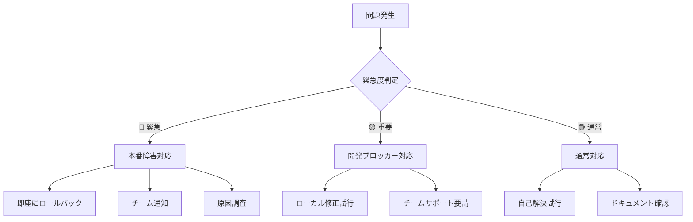

# トラブルシューティングガイド

## 🎯 このガイドについて

Suptia開発中によく発生する問題と、その解決方法を体系的にまとめています。問題が発生した際は、まずこのガイドを確認してください。

## 🚨 緊急時対応フロー



## 🔧 CI/CD関連の問題

### 1. format:check エラー

**症状**: `Prettier formatting issues found`

**原因**: コードフォーマットが統一されていない

**解決方法**:

```bash
# 自動フォーマット実行
npm run format

# 変更をコミット
git add .
git commit -m "style: fix formatting"
git push origin dev
```

**予防策**:

```bash
# VS Codeでformat on save設定
# .vscode/settings.json
{
  "editor.formatOnSave": true,
  "editor.defaultFormatter": "esbenp.prettier-vscode"
}
```

### 2. lint エラー

**症状**: `ESLint found issues in your code`

**解決方法**:

```bash
# 自動修正可能なエラーを修正
npm run lint:fix

# 手動修正が必要なエラーを確認
npm run lint

# 特定ファイルのみチェック
npx eslint apps/web/src/components/YourComponent.tsx
```

**よくあるlintエラーと対処法**:

| エラー                   | 原因                  | 解決方法                          |
| ------------------------ | --------------------- | --------------------------------- |
| `'React' is not defined` | React importなし      | `import React from 'react'`       |
| `Unused variable`        | 未使用変数            | 変数を削除または`_`プレフィックス |
| `Missing dependency`     | useEffect依存配列不足 | 依存配列に変数追加                |
| `Prefer const`           | letで定数定義         | `const`に変更                     |

### 3. test エラー

**症状**: `Tests failed`

**解決方法**:

```bash
# 失敗したテストを詳細表示
npm run test -- --reporter=verbose

# 特定テストファイルのみ実行
npm run test -- YourComponent.test.tsx

# ウォッチモードで開発
npm run test:watch

# カバレッジ確認
npm run test:coverage
```

**テスト修正のパターン**:

```typescript
// ❌ よくある間違い
test('should render component', () => {
  render(<MyComponent />);
  expect(screen.getByText('Hello')).toBeInTheDocument();
});

// ✅ 正しい書き方
test('should render component with hello message', async () => {
  render(<MyComponent />);
  const helloText = await screen.findByText('Hello');
  expect(helloText).toBeInTheDocument();
});
```

### 4. typecheck エラー

**症状**: `TypeScript compilation errors`

**解決方法**:

```bash
# 型チェック実行
npm run typecheck

# VS Codeで型エラー確認
# Ctrl+Shift+P → "TypeScript: Show All Errors"

# 型定義ファイル生成
npm run build
```

**よくある型エラーと対処法**:

```typescript
// ❌ Property 'id' does not exist on type 'unknown'
const handleClick = (item: unknown) => {
  console.log(item.id); // エラー
};

// ✅ 型ガードまたは型アサーション
const handleClick = (item: unknown) => {
  if (typeof item === "object" && item !== null && "id" in item) {
    console.log((item as { id: string }).id);
  }
};

// ✅ より良い解決法：適切な型定義
interface Item {
  id: string;
  name: string;
}

const handleClick = (item: Item) => {
  console.log(item.id); // OK
};
```

### 5. build エラー

**症状**: `Build failed`

**解決方法**:

```bash
# ローカルビルド実行
npm run build

# 詳細ログ確認
npm run build -- --debug

# キャッシュクリア後ビルド
npm run clean
npm run build

# 依存関係再インストール
rm -rf node_modules package-lock.json
npm install
npm run build
```

**よくあるビルドエラー**:

| エラー                      | 原因             | 解決方法                                 |
| --------------------------- | ---------------- | ---------------------------------------- |
| `Module not found`          | importパス間違い | パス修正                                 |
| `Cannot resolve dependency` | 依存関係不足     | `npm install`                            |
| `Out of memory`             | メモリ不足       | `NODE_OPTIONS=--max-old-space-size=4096` |
| `Syntax error`              | 構文エラー       | コード修正                               |

### 6. headers チェックエラー

**症状**: `Security headers validation failed`

**解決方法**:

```bash
# ヘッダーチェック実行
npm run headers

# 設定ファイル確認
cat vercel.json

# ローカルサーバーでヘッダー確認
npm run dev
curl -I http://localhost:3000
```

**必要なセキュリティヘッダー**:

```json
{
  "headers": [
    {
      "source": "/(.*)",
      "headers": [
        {
          "key": "X-Content-Type-Options",
          "value": "nosniff"
        },
        {
          "key": "X-Frame-Options",
          "value": "DENY"
        },
        {
          "key": "X-XSS-Protection",
          "value": "1; mode=block"
        }
      ]
    }
  ]
}
```

### 7. jsonld チェックエラー

**症状**: `JSON-LD validation failed`

**解決方法**:

```bash
# JSON-LD検証実行
npm run jsonld

# 特定ページの構造化データ確認
curl -s http://localhost:3000/products/example | grep -o '<script type="application/ld+json">.*</script>'

# Google構造化データテストツールで確認
# https://search.google.com/test/rich-results
```

### 8. pr-dod-check エラー

**症状**: `Definition of Done check failed`

**解決方法**:

```bash
# DoD チェック実行
npm run dod:check

# 個別項目確認
npm run test:coverage  # カバレッジ確認
npm run lint          # コード品質確認
npm run build         # ビルド確認
```

## 🌐 Vercel デプロイ関連の問題

### 1. Preview環境が更新されない

**症状**: devブランチにpushしてもPreview環境が古いまま

**診断手順**:

```bash
# 1. Vercelデプロイ状況確認
npm run get-preview-url

# 2. 環境変数確認
npm run env:check

# 3. ローカルビルドテスト
npm run build

# 4. Vercelログ確認
npx vercel logs
```

**解決方法**:

1. **Vercelダッシュボード確認**
   - https://vercel.com/your-team/suptia
   - デプロイ履歴とエラーログを確認

2. **環境変数の同期**

```bash
# Production環境変数をPreviewに同期
npm run env:sync
```

3. **手動デプロイ実行**

```bash
# Vercel CLIで手動デプロイ
npx vercel --prod=false
```

### 2. 本番デプロイが失敗する

**症状**: masterマージ後に本番デプロイエラー

**緊急対応**:

```bash
# 1. 即座にロールバック
npm run rollback:production

# 2. 問題調査
npm run monitor:production

# 3. ローカルで問題再現
npm run build
npm run start
```

**根本対応**:

1. **ビルドエラーの修正**
2. **環境変数の確認**
3. **依存関係の更新**
4. **再デプロイ**

### 3. 環境変数が見つからない

**症状**: `Error: Environment variable XXX is not defined`

**解決方法**:

```bash
# 1. ローカル環境変数確認
cat apps/web/.env.local

# 2. 必要な環境変数を追加
echo "MISSING_VAR=value" >> apps/web/.env.local

# 3. Vercel環境変数設定
npx vercel env add MISSING_VAR production
npx vercel env add MISSING_VAR preview

# 4. 環境変数同期確認
npm run env:sync
```

## 🔄 Git運用フロー関連の問題

### 1. masterブランチに直接pushエラー

**症状**: `remote: error: GH006: Protected branch update failed`

**原因**: masterブランチは保護されており、直接pushは禁止されています

**解決方法**:

```bash
# 1. 現在のブランチ確認
git branch --show-current

# 2. devブランチに切り替え
git switch dev

# 3. 変更をdevにpush
git push origin dev

# 4. GitHub UIでPR作成
echo "✅ GitHub UIでdev → masterのPRを作成してください"
echo "🔗 https://github.com/your-org/suptia/compare/master...dev"
```

**予防策**:

```bash
# Git設定でmasterへの直接pushを防止
git config branch.master.pushRemote no_push
```

### 2. PR作成時の必須チェック失敗

**症状**: `Some checks were not successful`

**診断手順**:

```bash
# 1. 失敗したチェックを確認
echo "GitHub PR画面で失敗したチェックの詳細を確認"

# 2. ローカルで同じチェックを実行
npm run format:check
npm run lint
npm run test
npm run typecheck
npm run build
npm run headers
npm run jsonld
npm run dod:check
```

**解決パターン**:

| 失敗チェック   | 解決コマンド       | 説明                     |
| -------------- | ------------------ | ------------------------ |
| `format:check` | `npm run format`   | コード自動フォーマット   |
| `lint`         | `npm run lint:fix` | ESLint自動修正           |
| `test`         | `npm run test:fix` | テスト修正               |
| `typecheck`    | 手動修正           | TypeScript型エラー修正   |
| `build`        | 手動修正           | ビルドエラー修正         |
| `headers`      | `vercel.json`修正  | セキュリティヘッダー設定 |
| `jsonld`       | 構造化データ修正   | JSON-LD形式修正          |
| `pr-dod-check` | DoD項目完了        | Definition of Done確認   |

### 3. 自動マージが実行されない

**症状**: 全チェック通過後もPRが自動マージされない

**診断手順**:

```bash
# 1. PR状態確認
echo "GitHub PR画面で以下を確認:"
echo "- ✅ All checks passed"
echo "- ✅ Required reviews approved"
echo "- ✅ No conflicts"
echo "- ✅ Branch is up to date"

# 2. ブランチ保護ルール確認
echo "Settings > Branches > master の設定を確認"
```

**解決方法**:

1. **レビュー承認が不足**
   - 最低1名の承認が必要
   - コードオーナーの承認が必要な場合あり

2. **ブランチが古い**

```bash
git switch dev
git pull origin master
git push origin dev
```

3. **コンフリクトが存在**

```bash
git switch dev
git merge origin/master
# コンフリクト解決
git push origin dev
```

### 4. devブランチとmasterの同期問題

**症状**: devブランチがmasterより古い状態

**解決方法**:

```bash
# 1. masterの最新を取得
git switch master
git pull origin master

# 2. devブランチを更新
git switch dev
git merge master
git push origin dev

# 3. 確認
git log --oneline --graph --all -10
```

**自動化スクリプト**:

```bash
#!/bin/bash
# scripts/sync-dev-branch.sh

echo "🔄 devブランチをmasterと同期中..."

# masterの最新を取得
git switch master
git pull origin master

# devブランチを更新
git switch dev
git merge master

if [ $? -eq 0 ]; then
    git push origin dev
    echo "✅ devブランチの同期完了"
else
    echo "❌ マージコンフリクトが発生しました"
    echo "手動でコンフリクトを解決してください"
    exit 1
fi
```

### 5. コンフリクトが発生した場合

**症状**: `CONFLICT (content): Merge conflict`

**解決方法**:

```bash
# 1. コンフリクトファイル確認
git status

# 2. VS Codeでコンフリクト解決
code .

# 3. 解決後の確認
git diff --check

# 4. 解決をコミット
git add .
git commit -m "resolve: merge conflict between dev and master"
git push origin dev
```

**コンフリクト解決のベストプラクティス**:

- `<<<<<<< HEAD` から `=======` までが現在のブランチ
- `=======` から `>>>>>>> branch-name` までがマージ対象ブランチ
- 両方の変更を保持する場合は適切に統合
- テストを実行して動作確認

### 6. 間違ったコミットをした場合

**ケース別解決方法**:

**A. まだpushしていない場合**:

```bash
# 最新コミットメッセージを修正
git commit --amend -m "correct commit message"

# 最新コミットを取り消し（変更は保持）
git reset --soft HEAD~1

# 最新コミットを完全に取り消し
git reset --hard HEAD~1
```

**B. 既にpushした場合**:

```bash
# 新しいコミットで変更を取り消し
git revert HEAD
git push origin dev

# 複数コミットを取り消し
git revert HEAD~2..HEAD
git push origin dev
```

**C. 機密情報をコミットした場合**:

```bash
# 緊急対応：履歴から完全削除
git filter-branch --force --index-filter \
  'git rm --cached --ignore-unmatch path/to/sensitive/file' \
  --prune-empty --tag-name-filter cat -- --all

# 強制push（危険：チームに事前通知）
git push origin --force --all
```

### 7. ブランチ切り替えエラー

**症状**: `error: Your local changes would be overwritten by checkout`

**解決方法**:

```bash
# 1. 変更を一時保存
git stash push -m "work in progress"

# 2. ブランチ切り替え
git switch dev

# 3. 変更を復元
git stash pop

# または、変更をコミットしてから切り替え
git add .
git commit -m "wip: temporary commit"
git switch dev
```

### 8. リモートブランチが見つからない

**症状**: `fatal: 'origin/dev' does not exist`

**解決方法**:

```bash
# 1. リモート情報を更新
git fetch origin

# 2. リモートブランチ一覧確認
git branch -r

# 3. devブランチが存在しない場合は作成
git checkout -b dev
git push -u origin dev
```

### 9. Git履歴が汚れている

**症状**: マージコミットが多すぎる、コミット履歴が複雑

**予防策**:

```bash
# リベースを使用してクリーンな履歴を維持
git switch dev
git rebase master

# コンフリクト解決後
git rebase --continue

# 強制push（注意：他の開発者と調整）
git push origin dev --force-with-lease
```

**チーム運用ルール**:

- devブランチでは`git merge`を使用
- 個人ブランチでは`git rebase`を使用
- masterへのマージは必ずPR経由

## 🔧 開発環境の問題

### 1. npm install エラー

**症状**: `npm ERR! peer dep missing`

**解決方法**:

```bash
# 1. キャッシュクリア
npm cache clean --force

# 2. node_modules削除
rm -rf node_modules package-lock.json

# 3. 再インストール
npm install

# 4. Node.jsバージョン確認
node --version  # v18以上必要
```

### 2. ポート3000が使用中

**症状**: `Error: listen EADDRINUSE: address already in use :::3000`

**解決方法**:

```bash
# 1. 使用中のプロセス確認
lsof -ti:3000

# 2. プロセス終了
kill -9 $(lsof -ti:3000)

# 3. 別ポートで起動
npm run dev -- --port 3001
```

### 3. 開発サーバーが起動しない

**診断手順**:

```bash
# 1. Node.jsバージョン確認
node --version

# 2. 依存関係確認
npm list --depth=0

# 3. 環境変数確認
cat apps/web/.env.local

# 4. ログ確認
npm run dev 2>&1 | tee debug.log
```

## 📊 パフォーマンス問題

### 1. ビルドが遅い

**症状**: ビルド時間が10分以上

**解決方法**:

```bash
# 1. 並列ビルド有効化
export NODE_OPTIONS="--max-old-space-size=4096"

# 2. キャッシュ活用
npm run build -- --cache

# 3. 不要なファイル除外
# .gitignore と .vercelignore を確認

# 4. 依存関係最適化
npm audit
npm update
```

### 2. テスト実行が遅い

**解決方法**:

```bash
# 1. 並列実行
npm run test -- --maxWorkers=4

# 2. 変更ファイルのみテスト
npm run test -- --onlyChanged

# 3. 特定テストのみ実行
npm run test -- --testNamePattern="YourTest"
```

## 🆘 エスカレーション基準

### 自己解決を試みる時間の目安

| 問題の種類   | 自己解決時間 | エスカレーション先 |
| ------------ | ------------ | ------------------ |
| 環境設定問題 | 30分         | チームSlack        |
| ビルドエラー | 1時間        | Tech Lead          |
| テストエラー | 1時間        | チームSlack        |
| デプロイ問題 | 15分         | DevOps             |
| 本番障害     | 即座         | Tech Lead + DevOps |

### エスカレーション時の情報

問題をエスカレーションする際は、以下の情報を含めてください：

```markdown
## 問題の概要

[問題の簡潔な説明]

## 発生環境

- OS: [macOS/Windows/Linux]
- Node.js: [バージョン]
- ブランチ: [dev/master]
- 最後の成功時点: [時刻]

## エラーメッセージ
```

[エラーメッセージをそのまま貼り付け]

```

## 試した解決方法
1. [試した方法1]
2. [試した方法2]
3. [試した方法3]

## 期待する結果
[どうなってほしいか]

## 緊急度
[🔴緊急/🟡重要/🟢通常]
```

## 🤖 自動診断ツール

### Git運用フロー診断

```bash
# Git関連の問題を自動診断
npm run diagnose:git

# 特定の問題のみ確認
git status
git branch --show-current
```

**診断内容**:

- 現在のブランチ確認
- 作業ディレクトリの状態
- リモートとの同期状況
- ブランチ保護設定
- 最近のエラー履歴

### CI/CD パイプライン診断

```bash
# CI/CDチェックを自動診断
npm run diagnose:ci

# 特定のチェックのみ実行
npm run diagnose:ci -- --check=lint
npm run diagnose:ci -- --check=test
```

**診断内容**:

- 環境設定確認
- 各品質チェックの実行
- エラーの詳細分析
- 自動修正可能項目の特定

### 包括的診断

```bash
# すべての診断を実行
npm run diagnose:all

# 自動修正可能な項目を修正
npm run fix:auto
```

### 診断結果の活用

診断ツールは以下の情報を提供します：

1. **問題の特定**: エラーの原因を自動分析
2. **解決方法**: 具体的な修正手順を提案
3. **実行コマンド**: コピー&ペーストで実行可能
4. **優先度**: 緊急度に応じた対応順序
5. **関連ドキュメント**: 詳細情報へのリンク

## 📚 参考リンク

- [開発フローガイド](./DEVELOPMENT_WORKFLOW.md)
- [クイックリファレンス](./QUICK_REFERENCE.md)
- [Next.js Documentation](https://nextjs.org/docs)
- [Vercel Documentation](https://vercel.com/docs)
- [GitHub Actions Documentation](https://docs.github.com/en/actions)

## 🆘 緊急時対応

### 即座に実行すべきコマンド

```bash
# 1. 現状把握
npm run diagnose:all

# 2. 自動修正
npm run fix:auto

# 3. 手動確認
npm run precommit

# 4. 問題が解決しない場合
echo "チームSlackで支援を要請してください"
```

### エスカレーション時のテンプレート

```markdown
## 🚨 技術的支援が必要です

**問題の概要**: [簡潔に説明]

**診断結果**:
```

[npm run diagnose:all の出力をここに貼り付け]

```

**試した解決方法**:
- [ ] npm run fix:auto
- [ ] npm run precommit
- [ ] [その他試した方法]

**緊急度**: [🔴緊急/🟡重要/🟢通常]

**環境情報**:
- OS: [macOS/Windows/Linux]
- Node.js: [バージョン]
- ブランチ: [現在のブランチ]
```

---

💡 **Tip**: 問題解決後は、このガイドに新しい解決方法を追加して、チーム全体の知識を共有しましょう！
